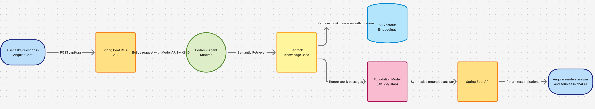

# 🧠 AI-KB-Chat

> **An intelligent knowledge-aware chatbot leveraging AWS Bedrock Knowledge Base and Amazon S3 Vector Store for context-driven enterprise Q&A**

---

## 🚀 Tech Stack & Features

| Technology | Purpose |
|-------------|----------|
|  | Frontend SPA built using Angular 16 and Angular Material |
|  | Backend REST API layer |
|  | Core business logic |
|  | Foundation model access layer |
|  | Retrieves contextually relevant data |
|  | Vector embeddings & document storage |
|  | Serverless runtime |
|  | API exposure & routing |
|  | Secure global distribution |

---

## 🧩 Architecture

The system enables users to chat with an enterprise knowledge base through an Angular UI.  
Requests flow through the Spring Boot API → AWS Bedrock Knowledge Base → Amazon S3 Vector Store (Preview).



> *(Generated architecture diagram — included below for reference)*  
> 

---

## 🧠 Key Highlights

- **Bedrock Knowledge Base Integration:**  
  Uses Retrieval-Augmented Generation (RAG) to provide precise, source-aware answers.  
- **Amazon S3 Vector Store (Preview):**  
  Cost-efficient alternative to OpenSearch for vector storage.  
- **Spring Boot + Angular Monorepo:**  
  Seamless full-stack communication and simplified deployment.  
- **Secure Cloud Distribution:**  
  Delivered through AWS CloudFront + Route 53 + S3.  
- **Scalable Serverless Backend:**  
  Uses AWS Lambda with API Gateway for zero-maintenance scaling.

---

## 🧭 Folder Structure

```
ai-kb-chat/
│
├── frontend/                # Angular 16 SPA
│   ├── src/
│   └── dist/
│
├── backend/                 # Spring Boot REST backend
│   ├── src/main/java/com/dct/kb/ai_chat/
│   └── target/
│
├── template.yml             # SAM template for AWS Lambda deployment
└── README.md
```

---

## 🖼️ Screenshots

> _Placeholder for screenshots_  
> (Chat UI, Knowledge Base Explorer, Response Flow, etc.)

---

## 🧾 License

Distributed under the **MIT License**.

---

### 👤 Author
**DCT (Durga Charan Tadi)**  
🚀 _Building intelligent cloud-native apps integrating AI + AWS + Java + Angular_
